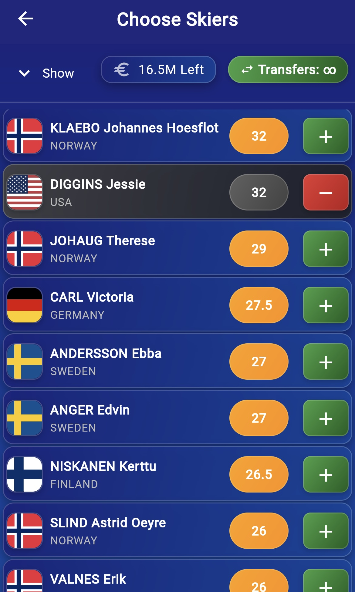

# Fantasy Cross-Country Skiing App

A fantasy sports app for cross-country skiing, inspired by Fantasy Premier League (FPL). Users create a team of six real-world skiers (3 men and 3 women), each with a price based on performance. With a limited budget, users must choose wisely. Points are awarded based on actual race results.

This project is a fully functional Flutter and Firebase mobile application designed for end users. It showcases a complete full-stack implementation with authentication, team management, and interactive features, ready for production use.
## Features

-  Pick 3 male and 3 female skiers to form your fantasy team
-  Budget system – stronger skiers cost more
-  Earn points based on real-world race results
-  Join private mini-leagues with friends
-  Global leaderboard to compete with all users
-  Firebase authentication (login, signup)
-  Firebase Firestore database to manage skiers, teams, and points

## Tech Stack

- **Flutter** – Cross-platform mobile framework
- **Firebase** – Auth, Firestore, Hosting
- **Dart** – Language used in Flutter

## Firebase Configuration

Some files have been excluded from this repository for security reasons:

- `google-services.json` (Android)
- `GoogleService-Info.plist` (iOS)
- `firebase_options.dart`

###  Real-world Results from FIS

This app fetches real-time race results directly from the [FIS (International Ski Federation)](https://www.fis-ski.com/) website. A custom HTML parser scrapes each competition’s result page and extracts skier placements. These results are then written to Firebase, updating each skier’s performance for the current game week.

- Results are fetched using HTTP requests (`http.get`) and parsed with the `html` package.
- Skier names are matched against those in the app database.
- Competitions are stored per week, and users receive points accordingly.

> _This approach allows for near real-time scoring based on actual events in the skiing world._

---

###  Scoring System

Points are awarded to skiers based on their placement in each race. The scoring follows a descending scale inspired by Fantasy Premier League and World Cup formats.

| Placement | Points |
|-----------|--------|
| 1st       | 100    |
| 2nd       | 80     |
| 3rd       | 60     |
| 4th       | 50     |
| 5th       | 45     |
| 6th       | 40     |
| 7th       | 35     |
| 8th       | 30     |
| 9th       | 25     |
| 10th      | 20     |
| 11–30     | 19 → 1 |
| 31+       | 0      |

> Captains earn **double points**, and each user can select one captain per game week.

This system is designed to reward consistent high performance while encouraging strategic team-building within a limited budget.

##  Project Status

This app is mostly functional and was tested during the end of the previous cross-country skiing season. Core features like team creation, scoring system, captain bonus points, and leaderboard are working as intended.

However, some features are still under development:

- Not all real-world skiers have been added yet
- Users can currently make unlimited transfers (weekly transfer limits are not enforced)
- Some visual tweaks and data validations are still to come

Despite this, the app provides a solid foundation and demonstrates:
- Firebase integration (Auth, Firestore)
- Live points and leaderboard calculation
- Dynamic team management
- Responsive UI for mobile, tablet, and desktop

##  Screenshots

###  Login Screen
Basic login interface using Firebase Authentication.

---

###  Home Screen
Main screen showing your selected fantasy team and current gameweek.

---

###  Choose Skiers
The screen where users select 3 male and 3 female skiers to form their team.

---

###  Menu Layout
Menu

---

To run the app locally, you'll need to set up your own Firebase project and configure these files. This project is not intended for reuse or public deployment — it's a showcase of functionality and design.

---

Feel free to check out the code or contact me if you have questions about the implementation.
